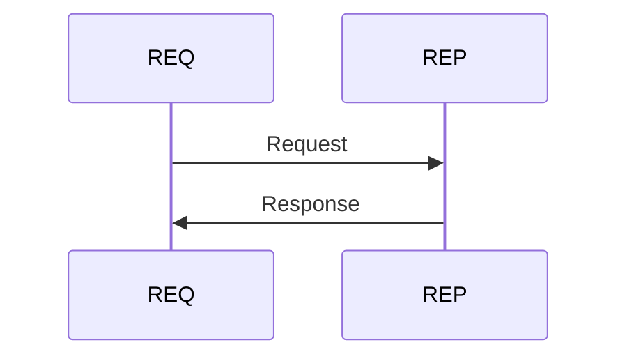
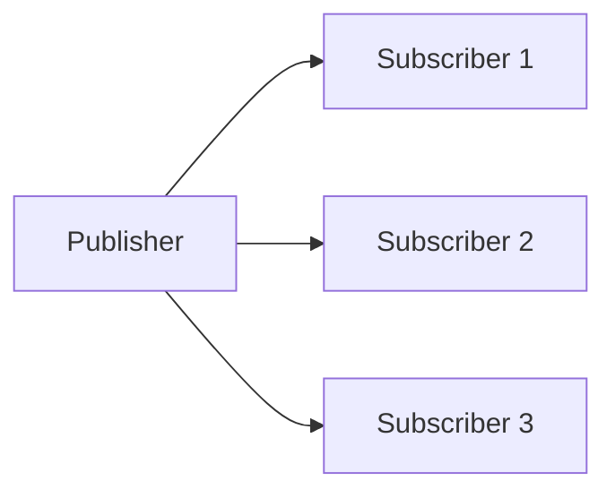
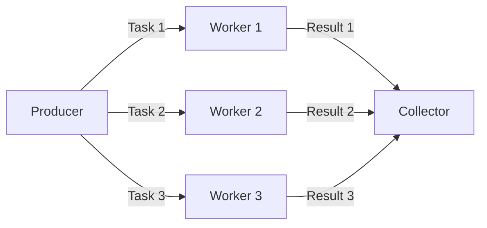

ZMQ is a high-performance, asynchronous messaging library that works without any broker. At its core is the socket, an object capable of distributing atomic messages and connecting *N to N*.

ZMQ automatically reconnects if the network connection between two sockets breaks. After performing a `connect`, a socket can start reading/writing messages that will be delivered once the other end binds.

Every socket has a type that defines the communication pattern it follows. Although the sockets for a ZMQ pattern come in pairs, like client and server, it doesn't matter which one performs the `bind` and which one performs the `connect`.

Every socket has a message queue, handled automatically. Once the queue is full, the socket blocks or discards messages depending on its type.

To create sockets, a `zmq` context must first be created and initialized — it acts as a socket factory. There should be exactly one context per process; it is responsible for creating the background I/O thread. As a rule of thumb, use one I/O thread per exchanged gigabyte, adjustable via `zmq_ctx_set`.

## Request-Reply Sockets

`ZMQ_REP` and `ZMQ_REQ` sockets expose two functions, `send` and `receive`.


*ZMQ REQ-REP pattern*

They expect to be called in order: a `REP` socket can `send` only once after it `receive`s, and the reverse is true for `REQ`.


*ZMQ REQ-REP message exchange*

### Python example

Server:
```python
import time
import zmq

context = zmq.Context()
socket = context.socket(zmq.REP)
socket.bind("tcp://*:5555")

while True:
    # Wait for next request from client
    message = socket.recv()
    print(f"Received request: {message}")

    # Do some 'work'
    time.sleep(1)

    # Send reply back to client
    socket.send(b"World")
```

Client:
```python
import zmq

context = zmq.Context()

# Socket to talk to server
print("Connecting to hello world server...")
socket = context.socket(zmq.REQ)
socket.connect("tcp://localhost:5555")

# Do 10 requests, waiting each time for a response
for request in range(10):
    print(f"Sending request {request} ...")
    socket.send(b"Hello")

    # Get the reply
    message = socket.recv()
    print(f"Received reply {request} [ {message} ]")
```

## Publisher-Subscriber Sockets


*ZMQ PUB-SUB pattern*

`ZMQ_PUB` sockets expose a `send` function (no `receive`), while `ZMQ_SUB` sockets expose only `receive`.

A `ZMQ_SUB` socket must subscribe via `setsockopt`, passing a "filter" — the prefix of all messages the subscriber is interested in. A subscriber socket can subscribe multiple times.

> Be aware of the **slow joiner** symptom affecting PUB-SUB sockets: it's not possible to assume when a subscriber will start receiving messages.

A publisher can `bind` to more than one address, and a subscriber can `connect` to more than one publisher, in which case it receives interleaved messages.

Filtering happens on the publisher side. If a publisher has no connections, it just drops the messages. But if a subscriber is slow, the publisher queues up messages for it.

### Python example

Publisher:
```python
import zmq
from random import randrange

context = zmq.Context()
socket = context.socket(zmq.PUB)
socket.bind("tcp://*:5556")

while True:
    zipcode = randrange(1, 100000)
    temperature = randrange(-80, 135)
    relhumidity = randrange(10, 60)

    socket.send_string(f"{zipcode} {temperature} {relhumidity}")
```

Subscriber:
```python
import sys
import zmq

# Socket to talk to server
context = zmq.Context()
socket = context.socket(zmq.SUB)

print("Collecting updates from weather server...")
socket.connect("tcp://localhost:5556")

# Subscribe to zipcode, default is NYC, 10001
zip_filter = sys.argv[1] if len(sys.argv) > 1 else "10001"
socket.setsockopt_string(zmq.SUBSCRIBE, zip_filter)

# Process 100 updates
total_temp = 0
for update_nbr in range(100):
    string = socket.recv_string()
    zipcode, temperature, relhumidity = string.split()
    total_temp += int(temperature)

print(f"Average temperature for zipcode '{zip_filter}' was {total_temp / (update_nbr+1)} F")
```

## Push-Pull Sockets


*ZMQ Push-Pull pattern*

`ZMQ_PUSH` sockets distribute messages among connected workers, while `ZMQ_PULL` sockets collect messages evenly from multiple sources.

### Python example

Producer:
```python
import zmq
import random
import time

context = zmq.Context()

# Socket to send messages on
sender = context.socket(zmq.PUSH)
sender.bind("tcp://*:5557")

# Socket with direct access to the sink: used to synchronize start of batch
sink = context.socket(zmq.PUSH)
sink.connect("tcp://localhost:5558")

print("Press Enter when the workers are ready: ")
_ = input()
print("Sending tasks to workers...")

# The first message is "0" and signals start of batch
sink.send(b'0')

random.seed()

# Send 100 tasks
total_msec = 0
for task_nbr in range(100):
    # Random workload from 1 to 100 msecs
    workload = random.randint(1, 100)
    total_msec += workload

    sender.send_string(f"{workload}")

print(f"Total expected cost: {total_msec} msec")

# Give 0MQ time to deliver
time.sleep(1)
```

Worker:
```python
import sys
import time
import zmq

context = zmq.Context()

# Socket to receive messages on
receiver = context.socket(zmq.PULL)
receiver.connect("tcp://localhost:5557")

# Socket to send messages to
sender = context.socket(zmq.PUSH)
sender.connect("tcp://localhost:5558")

# Process tasks forever
while True:
    s = receiver.recv()

    # Simple progress indicator for the viewer
    sys.stdout.write('.')
    sys.stdout.flush()

    # Do the work
    time.sleep(int(s) * 0.001)

    # Send results to sink
    sender.send(b'')
```

Collector:
```python
import sys
import time
import zmq

context = zmq.Context()

# Socket to receive messages on
receiver = context.socket(zmq.PULL)
receiver.bind("tcp://*:5558")

# Wait for start of batch
s = receiver.recv()

tstart = time.time()

# Process 100 confirmations
for task_nbr in range(100):
    s = receiver.recv()
    if task_nbr % 10 == 0:
        sys.stdout.write(':')
    else:
        sys.stdout.write('.')
    sys.stdout.flush()

tend = time.time()
print(f"Total elapsed time: {(tend-tstart)*1000} msec")
```

## Cheatsheet

### Socket patterns
```text
REQ <-> REP     # request-reply, strict send/receive alternation
PUB -> SUB      # publish-subscribe, subscriber filters via setsockopt
PUSH -> PULL    # pipeline, distributes/collects across workers
```

### Setup
```python
context = zmq.Context() # one per process
socket = context.socket(zmq.REQ) # or REP, PUB, SUB, PUSH, PULL
socket.bind("tcp://*:5555")   # or
socket.connect("tcp://localhost:5555")
```
