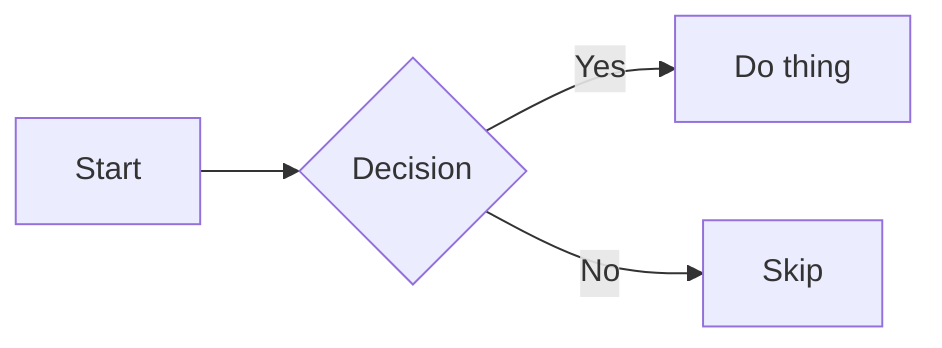
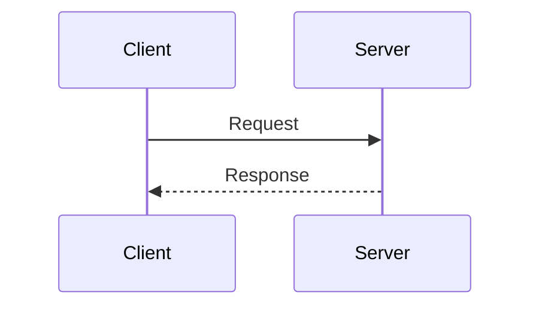
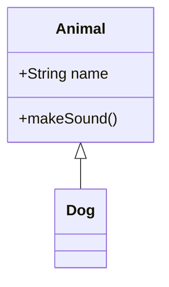
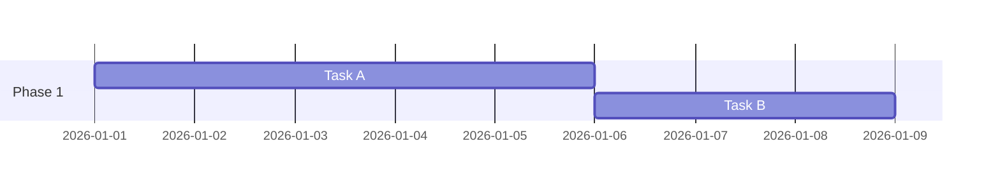

Text-based diagramming tool rendered from fenced code blocks tagged `mermaid`. Supported natively by Quartz, GitHub, and Obsidian's preview.

## Flowchart

Declare a direction (`TD` top-down, `LR` left-right), then nodes and edges.

```text
flowchart LR
    A[Start] --> B{Decision}
    B -->|Yes| C[Do thing]
    B -->|No| D[Skip]
```



Node shapes: `[Rectangle]`, `(Rounded)`, `{Decision}`, `((Circle))`, `[[Subroutine]]`.

## Sequence diagram

Models interactions between participants over time.

```text
sequenceDiagram
    participant Client
    participant Server
    Client->>Server: Request
    Server-->>Client: Response
```



Use `->>` for a solid arrow (call), `-->>` for a dashed arrow (return), `activate`/`deactivate` to show lifelines.

## Class diagram

```text
classDiagram
    class Animal {
        +String name
        +makeSound()
    }
    Animal <|-- Dog
```



## Gantt chart

```text
gantt
    dateFormat  YYYY-MM-DD
    section Phase 1
    Task A :a1, 2026-01-01, 5d
    Task B :after a1, 3d
```



## Cheatsheet

### Diagram types
- `flowchart TD` # top-down flowchart
- `sequenceDiagram` # actor interactions
- `classDiagram` # UML class relationships
- `stateDiagram-v2` # state machines
- `erDiagram` # entity-relationship
- `gantt` # project timelines
- `pie` # pie chart

### Styling
- `style A fill:#f9f,stroke:#333,stroke-width:2px` # style a single node
- `classDef highlight fill:#f96;` # define a reusable class
- `class A,B highlight` # apply a class to nodes
