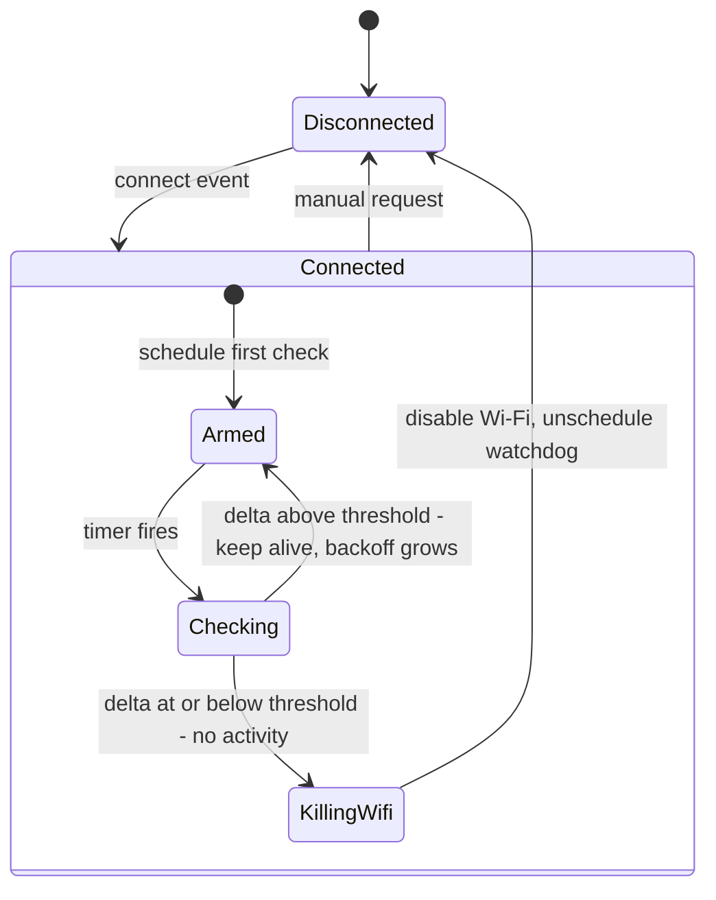

[[kobo-libra-colour-battery-drain-part-3 | Read part 3]]

I managed to conduct the experiments following the [[kobo-libra-colour-battery-drain-part-3#The protocol | strict protocol I devised in part 3]]. And I got some (not so) surprising results.
## The Results

Just to have a little recap:

- **Scenario A**: Wifi on, no optimisation at all.
- **Scenario B**: No wifi.
- **Scenario C**: Wifi on, "Disable when inactive" on.

Here're the figures:

| Scenario | Hourly Draw | Duration   |
| -------- | ----------- | ---------- |
| A        | 3.92%       | 1:01 hours |
| B        | 0.98%       | 1:01 hours |
| C        | 3.93%       | 1:01 hours |

The first important discovery is that the numbers I got for all the previous experiment were vastly biased by page turning (I use a font that is quite big, so I turn a lot of pages). 

The second "annoying" finding is that we got the same result for scenario **A** and **C** but I was hoping to see a difference. This leads to four possible options:
1. I fumbled the experiment somehow.
2. The optimisation didn't kick in.
3. The optimisation is not that effective.
4. The optimisation is affected by some bug.

A third little side-investigation I conducted is about the `keepalive` plugin. I know for sure it didn't taint the experiment because I disabled it, but since I'm curious I digged in its source code to check if it can affect the wifi usage. Well, it doesn't it's just a simple plugin that will disable `autosuspend` (at least on **Kobo** and **Cervantes** devices).

## What now?

To avoid polluting the experiment (and sincerely because I though that `Disable WiFi when inactive` would do the trick) I ran all the experiment without [[koreader#Enable debug log | activating the debug log]].

Now it's time to enable it and see what's actually happening under the hood.

## The experiment

After enabling the verbose logging, I re-enabled `Disable WiFi when inactive`, connected to my network and waited 6 long minutes.

But in the meanwhile...

## How does the `Disable Wi-Fi when inactive` works

Once Wi-Fi connects, a watchdog starts polling the interface's outbound packet counter (`tx_packets`) on a growing schedule. If it sees no meaningful traffic between two polls, it turns Wi-Fi off. If the network traffics is over a certain threshold it just keeps Wi-Fi on and checks again later, waiting longer each time.

### Key numbers

- Default first check: **5 min** (`default_network_timeout_seconds`)
- Backoff ceiling: **30 min** (`max_network_timeout_seconds`)
- Both are **halved** (2.5 min / 15 min) if `auto_standby_timeout_seconds` is
  set (>0) — computed once when the module loads, not re-read live.
- Noise margin: **12 packets**, scaled up proportionally as the check
  interval grows (so a 10-minute gap tolerates ~24 packets, not just 12).

### Only TX, not RX

The watchdog reads `/sys/class/net/<iface>/statistics/tx_packets`  packets *this device sent*, not received. Traffic from other devices on the same network never counts. What can legitimately bump this counter while "idle": DHCP lease renewal, ARP/neighbor-reachability checks to the gateway, IGMP membership reports, wpa_supplicant keep-alives, none of which depend on how busy the broader network is.

## The experiment results

I run the experiment multiple times to have consistent readings, but it never triggered the disconnection. Fortunately the default debug log also reports how many packets we transmitted and every time we were off by 5, 6 packets. So something is a little too chatty on my kobo.

## What's next?

Given the current situation, I believe the next solid point should be to find who's responsible for those network transmissions and If I won't be able to rule it out, to tweak a little the threshold in order to let the mechanism kick in.

See you soon.